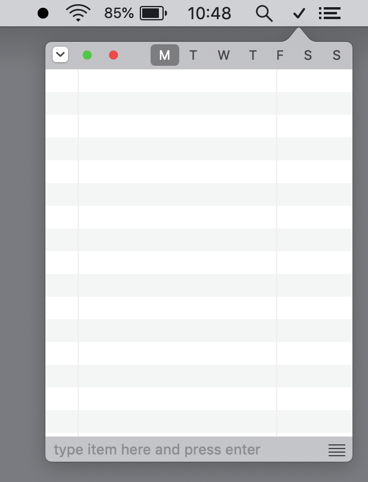
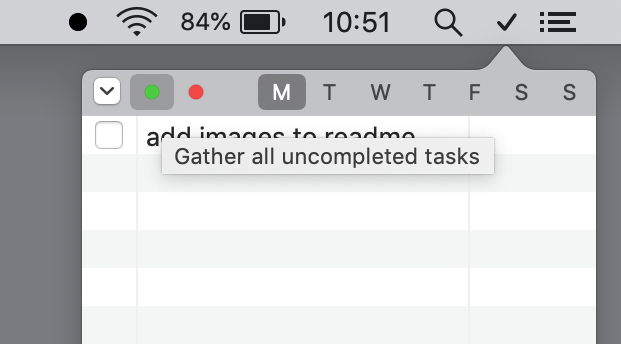
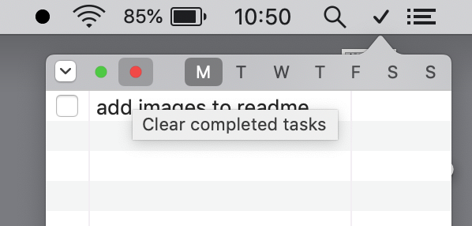
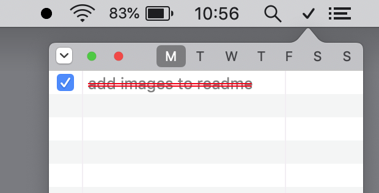

# Tick

A weekly to do list menu bar application for macos written in swift and licenced under a FreddBSD Licence.
The application will open on your list for today, gather uncompleted tasks to todays list, clear completed tasks.

Green button gathers all uncompleted tasks to the current day

Red button removes all completed task from the selected day

